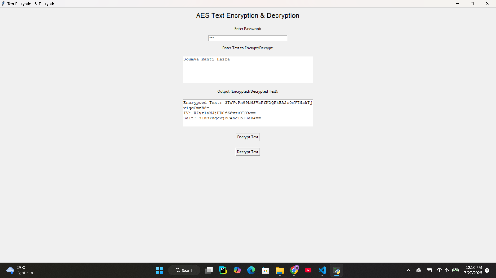
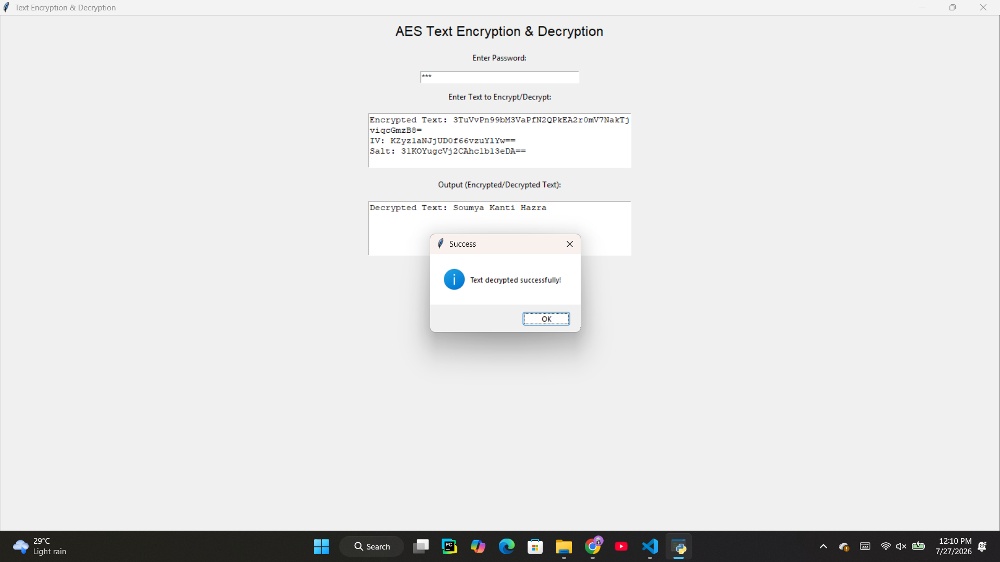

# 🔐 CyberCrypt — AES Text Encryption & Decryption

A simple cybersecurity application for **secure text encryption and decryption using AES-256**.
The project provides a user-friendly **cybersecurity-themed Tkinter GUI** and demonstrates password-based key derivation, encryption, decryption, random salt generation, and IV handling.

---

## 🛡️ Project Overview

**CyberCrypt** is a desktop-based text encryption and decryption tool developed using Python.

The application allows users to:

* 🔒 Encrypt sensitive text using **AES-256**
* 🔓 Decrypt encrypted text using the correct password
* 🔑 Derive encryption keys using **PBKDF2-HMAC-SHA256**
* 🧂 Generate a unique random **salt**
* 🎲 Generate a random **Initialization Vector (IV)**
* 🖥️ Use a cybersecurity-themed graphical interface
* ⚡ Perform encryption and decryption locally without sending data to a server

This project was created as a practical demonstration of fundamental **cryptography and cybersecurity concepts**.

---

## ✨ Features

### 🔐 AES-256 Encryption

The application uses the AES symmetric encryption algorithm with a **256-bit key**.

### 🔑 Password-Based Key Derivation

The user's password is converted into a cryptographic key using:

```text
PBKDF2-HMAC-SHA256
```

with:

```text
Key Size   : 256 bits
Iterations : 100,000
Salt       : 16 bytes
```

### 🧂 Random Salt

A new random 16-byte salt is generated for every encryption operation.

### 🎲 Random IV

A new 16-byte Initialization Vector is generated for every encryption operation.

### 🖥️ Cybersecurity UI

The application uses a dark cybersecurity-inspired interface with:

* Terminal-style typography
* Green security indicators
* Encryption/decryption panels
* Security status messages
* Password-protected input

### 🔓 Secure Decryption

Encrypted data can only be successfully decrypted when the correct password, IV, and salt are supplied.

---

## 🖥️ Application Screenshots

### 🔐 Encryption Interface



### 🔓 Decryption Interface



---

## 🏗️ Project Structure

```text
aes-text-encryption/
│
├── AES/
│   │
│   ├── AES.py
│   │
│   └── assets/
│       └── screenshots/
│           ├── encryption.png
│           └── decryption.png
│
├── README.md
│
└── LICENSE
```

---

## ⚙️ Technologies Used

| Technology   | Purpose                       |
| ------------ | ----------------------------- |
| Python       | Application development       |
| Tkinter      | Graphical User Interface      |
| Cryptography | Cryptographic operations      |
| AES-256      | Symmetric encryption          |
| PBKDF2       | Password-based key derivation |
| SHA-256      | Cryptographic hash function   |
| Base64       | Encoding encrypted data       |
| Git          | Version control               |
| GitHub       | Source code hosting           |

---

## 🔄 How It Works

The encryption process follows these steps:

```text
                 User Password
                       │
                       ▼
                Generate Salt
                       │
                       ▼
             PBKDF2-HMAC-SHA256
                       │
                       ▼
                 AES-256 Key
                       │
                       ▼
                 Generate IV
                       │
                       ▼
                 Plaintext
                       │
                       ▼
               PKCS7 Padding
                       │
                       ▼
                  AES-CBC
                       │
                       ▼
              Encrypted Data
                       │
                       ▼
              Base64 Encoding
                       │
                       ▼
       Encrypted Text + IV + Salt
```

---

## 🔓 Decryption Process

```text
Encrypted Text + IV + Salt
             │
             ▼
       Base64 Decoding
             │
             ▼
        User Password
             │
             ▼
       PBKDF2-HMAC-SHA256
             │
             ▼
          AES-256 Key
             │
             ▼
          AES-CBC
             │
             ▼
       Remove PKCS7 Padding
             │
             ▼
       Original Plaintext
```

---

## 🚀 Installation

### 1. Clone the Repository

```bash
git clone https://github.com/Soumya-CSE/aes-text-encryption.git
```

### 2. Navigate to the Project

```bash
cd aes-text-encryption
```

### 3. Install the Required Library

```bash
pip install cryptography
```

Or:

```bash
python -m pip install cryptography
```

### 4. Run the Application

```bash
python AES/AES.py
```

---

## 🧪 Example

### Input

```text
Password:
Cyber@123

Plaintext:
Hello Cyber Security
```

### Encryption Output

```text
Encrypted Text:
<generated ciphertext>

IV:
<generated IV>

Salt:
<generated salt>
```

The encrypted text, IV, and salt are different for each encryption operation because a new random salt and IV are generated.

### Decryption

Using the same password and generated encryption parameters:

```text
Decrypted Text:

Hello Cyber Security
```

---

## 🔐 Cryptographic Components

### AES-256

AES (Advanced Encryption Standard) is a symmetric encryption algorithm.

CyberCrypt uses:

```text
Algorithm : AES
Key Size  : 256-bit
Mode      : CBC
Block Size : 128-bit
```

### PBKDF2

PBKDF2 is used to derive a cryptographic key from the user's password.

```text
PBKDF2-HMAC-SHA256
Iterations: 100,000
Key Size: 32 bytes
Salt: 16 bytes
```

### PKCS7 Padding

AES operates on fixed-size blocks. PKCS7 padding is used to make the plaintext compatible with the AES block size.

---

## ⚠️ Security Note

This project is primarily intended for **educational and demonstration purposes**.

The current implementation uses:

```text
AES-256-CBC
```

CBC mode provides confidentiality but does not inherently provide authentication or integrity protection.

For a production-grade application, an authenticated encryption mode such as:

```text
AES-GCM
```

would be preferable because it provides both encryption and integrity/authentication.

---

## 🎯 Learning Objectives

This project demonstrates practical understanding of:

* Symmetric-key cryptography
* AES encryption
* AES-256
* CBC mode
* Initialization Vectors
* Cryptographic salts
* Password-based key derivation
* PBKDF2
* SHA-256
* PKCS7 padding
* Base64 encoding
* Python cryptography libraries
* Tkinter GUI development
* Git and GitHub version control

---

## 🔮 Future Improvements

Possible future improvements include:

* [ ] Add AES-GCM authenticated encryption
* [ ] Add file encryption and decryption
* [ ] Add password strength checking
* [ ] Add show/hide password option
* [ ] Add encrypted file export
* [ ] Add copy-to-clipboard functionality
* [ ] Add encryption history
* [ ] Add secure password generation
* [ ] Add drag-and-drop file encryption
* [ ] Improve error handling and validation

---

## 📚 Concepts Demonstrated

```text
Cybersecurity
     │
     ├── Cryptography
     │     ├── AES
     │     ├── AES-256
     │     ├── CBC
     │     └── IV
     │
     ├── Password Security
     │     ├── PBKDF2
     │     ├── SHA-256
     │     └── Salt
     │
     └── Secure Programming
           ├── Key Derivation
           ├── Padding
           └── Data Encoding
```

---

## 👨‍💻 Author

**Soumya Kanti Hazra**

B.Tech — Computer Science & Engineering

Interested in:

* 🛡️ Cybersecurity
* 🔐 Cryptography
* 🖥️ SOC / Blue Team
* 🌐 Network Security
* 🐍 Python

---

## 📄 License

This project is available under the **MIT License**.

See the [LICENSE](LICENSE) file for more information.

---

## ⭐ Support

If you found this project useful for learning cybersecurity or cryptography, consider giving the repository a ⭐ on GitHub.

